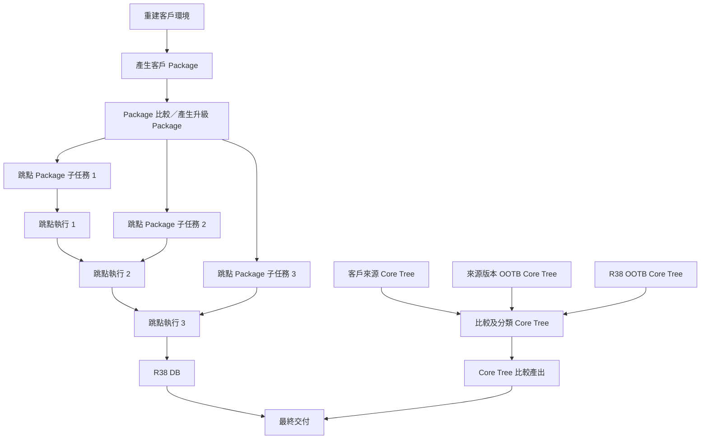

# Aras Innovator 升級協調工具－需求規格

狀態：需求訪談已確認，尚未進入程式實作  
確認日期：2026-08-01  
適用專案：Aras Upgrade Orchestrator

## 1. 目的

本工具協助升級人員在公司內部重建客戶 Aras Innovator 環境後，協調多跳點 Package 準備、DB 升級、Core Tree 比較、證據保存與最終交付。

第一版優先確保流程穩定、資料正確、可回復及可追溯，不追求全面自動化。

## 2. 共用依據

凡涉及 AML 的解析、比較、複製、修改及輸出，均須遵守：

- `docs/standards/AML_Structure_and_Traversal_Standard.md`

本規格補充 Package 比較專用的 CompareKey、Rule 1、Rule 2、檔案配對、備份及交付規則。若本規格與 AML 共用標準衝突，停止實作並先列出衝突。

本規格已將訪談中採用的 Rule 1／Rule 2 完整移入目前專案，不依賴其他專案文件或路徑。

## 3. 第一版範圍

### 3.1 包含範圍

1. 單人升級案件管理。
2. 受控執行、安全白名單及三級安全判定。
3. 客戶 Package 一次性產生流程。
4. Rule 1 OOTB 跳點差異包產生與重用。
5. Rule 2 客戶 Package 與 OOTB 跳點差異比較調整。
6. 多跳點 Package 子任務及依序 DB 跳點執行。
7. Core Tree A／B／C 比較與分類。
8. 不可覆寫執行歷程、更正紀錄、中斷恢復及安全重試。
9. R38 DB、正式適配 Package、Core Tree 比較產出及執行證據交付。
10. 可選的 AI 差異解釋、摘要與建議。

### 3.2 第一版非目標

1. 多人共享案件、角色分工或雙人簽核。
2. 讓 Codex／AI 成為核心流程必要依賴。
3. 自動操作 Aras Export。
4. 自動啟動或操作 Aras 升級工具。
5. 自動登入 Aras Innovator 驗證版本或服務。
6. 自動執行 DB 備份或還原。
7. 合併或修改 R38 Core Tree。
8. Package 逐 XML Checksum。
9. 比較或修改 Package 非 XML 檔案。
10. 額外重複封裝現行已有的客戶升級工具封存版本。

## 4. 運行模式與責任邊界

### 4.1 單機單人模式

- 第一版為單機 Windows 桌面工具。
- 每個案件由一位操作人員管理。
- 不需要中央伺服器、多人帳號或即時同步。
- 案件資料保存在該客戶升級目錄。
- 每位客戶使用自己新建立的各版本升級工具目錄，不共用可修改的 `Support` 目錄。

### 4.2 受控執行

工具負責工作流、相依關係、Runbook、前置檢查、鎖定及證據；狀態變更動作依三級安全判定處理：

| 等級 | 行為 |
|---|---|
| 自動執行 | 符合安全白名單、唯讀或已驗證可安全重複的動作。 |
| 單次確認 | 會改變重要狀態，且前置條件完整的動作。 |
| 阻擋 | 前置條件、備份、識別或安全證據不足的動作。 |

無法判定時一律阻擋或要求單次確認，不得視為自動允許。

### 4.3 單人確認關卡

- 高風險操作允許同一操作人員自行確認，不要求第二人登入。
- 確認前顯示目標、影響、必要備份、停止條件及 Rollback 資訊。
- 確認只對當次目標、參數與輸入版本有效。
- 條件改變時必須重新確認。

### 4.4 固定安全不變條件

下列項目不得由 Rule 設定或 AI 關閉：

- AML 無固定深度遞迴及節點分類。
- Package CompareKey 及人工確認條件。
- 覆寫前強制備份。
- 無可靠配對時不得修改。
- 工作目錄鎖定。
- 執行歷程不可覆寫。
- 未處置人工確認項目不得交付。
- AI不得發布規則、執行高風險動作或解除阻擋。

## 5. 案件、目錄與歷程

### 5.1 案件清單

每個客戶升級目錄根層必須有案件清單，至少記錄：

- 案件識別；
- 客戶代號；
- 來源與目標版本；
- 建立時間；
- 目前升級路徑；
- 各跳點客戶專用 `Support` 目錄；
- 產出、備份與現行封存版本位置。

工具不得只依資料夾名稱判斷案件。清單缺失、版本不符或輸入屬於其他案件時，受控動作必須阻擋。

### 5.2 既有升級工具目錄

- 工具登錄既有的客戶專用 `Support` 目錄，不搬移或重排內容。
- 原廠及正式適配 Package 位於 `Support\Solutions`。
- 除 `Solutions` 的受控調整外，不修改其他升級工具內容。
- Core Tree 不位於 `Support` 內，另行登錄及比較。
- K: 等 Windows 對應磁碟路徑可作為登錄位置。

### 5.3 工具專用資料

工具在案件根目錄的專用區域保存：

- 案件清單與執行紀錄；
- 客戶 Package 來源工作副本；
- 原始 `Solutions` 備份；
- OOTB 跳點差異包；
- Core Tree 比較產出；
- 差異與驗證摘要。

### 5.4 不可覆寫歷程

- 已發生的狀態轉換、確認、執行及結果只能追加，不得覆寫或刪除。
- 資料錯誤以更正紀錄處理；更正紀錄指向原紀錄並保存原因、正確內容、時間及操作人員。
- 規劃內容在執行前可編輯。
- 動作正式開始前固定當次輸入、參數、工具版本、目標及適用的紀錄欄位。
- 每次實際運行建立獨立執行嘗試，不覆蓋前次嘗試。

### 5.5 中斷與重試

- 工具或電腦中斷後，重新開啟案件可由案件清單與歷程重建狀態。
- 尚未完成的動作標記為「中斷」，不得自動續跑。
- 建立新執行嘗試前，必須證明動作具 Idempotency、已完成 Rollback，或已回到 Runbook 指定檢查點。
- 證據不足時直接阻擋重試。

### 5.6 平行處理

- 不同跳點 Package 與 Core Tree 可在背景平行執行。
- 只有可修改目錄完全不重疊時才允許平行。
- 可能寫入相同或重疊目錄時，阻擋後開始者。
- DB 跳點執行始終依升級路徑逐一進行。

## 6. 任務圖與升級路徑

### 6.1 術語

- **跳點 Package 子任務**：父任務「Package 比較／產生升級 Package」下，準備特定版本區間正式適配 Package 的子任務。
- **跳點執行**：實際將 DB 從來源版本升級至下一版本的執行節點，不是 Package 子任務。
- **升級路徑**：操作人員依已驗證原廠文件選定的有序跳點執行集合。

### 6.2 路徑決策

- 操作人員選定路徑，例如 `11SP5→11SP15→12SP18→R38`。
- 工具驗證路徑連續性並建立相依關係。
- AI可提出建議，但不得增刪或改變跳點。
- 任一跳點執行開始後，原路徑不得改寫；變更時建立新版路徑並保留舊歷程。

### 6.3 相依關係



- 各跳點 Package 子任務可分開或平行準備。
- 每個跳點執行等待自己的正式適配 Package。
- 第二個以後的跳點執行同時等待前一個跳點執行完成。
- Core Tree 是獨立任務，不阻擋 Package 準備或 DB 升級，但最終交付必須等待其完成。

## 7. 客戶 Package 一次性產生流程

### 7.1 輸入與目的

客戶提供來源版本 DB 與 Core Tree；公司內部重建客戶環境後，客戶 Package 基準只產生一次，供所有跳點 Package 比較共用。

### 7.2 原始 Package 備份

- DB 變更前先以人工方式使用對應版本 Aras Export 導出原始 Package 備份。
- 該備份保存客戶為避免客製 Package 導入衝突而刪除原廠項目前的既有狀態。
- 第一版只保存，不比較、不修復，也不得用作跳點比較輸入。

### 7.3 一次性流程

1. 完成前置檢查與 DB 備份證據。
2. 在首次 DB 變更前，由固定規則建立一次性流程鎖定。
3. 工具受控執行預先核准、版本固定且 Checksum 相符的 SQL Script，刪除 Package 相關 Table。
4. 工具受控導出同版本 OOTB Table。
5. 匯入客戶 DB 前再次經過單人確認。
6. 工具受控將 OOTB Table 匯入客戶 DB。
7. 操作人員人工使用對應版本 Aras Export 導出客戶 Package 基準。

AI不得產生、修改或自由組合 SQL。DB 還原始終由操作人員手動執行。

### 7.4 人工 Aras Export

- 不同來源版本使用其對應的 Export 工具。
- 每次操作建立獨立執行嘗試，失敗或中止不覆寫前次紀錄。
- 客戶環境異常可能導致全選導出終止；操作人員可取消選取異常項目後重新導出。
- 每個取消選取項目須記錄名稱、類型、原因及處置。
- 處置必須為：確認不屬升級客製內容、已以其他方式補充，或缺漏風險已明確接受。
- 未完成處置時任務保持阻擋，不能形成客戶 Package 基準。

### 7.5 一次性鎖定生命週期

- 首次 DB 變更開始後，不得另開新的完整產生流程。
- 失敗時，操作人員手動還原至該次執行前 DB 備份點。
- 備份識別與還原證據相符後，固定規則標記 `RolledBack`，才允許新執行嘗試。
- 客戶 Package 基準成功產生後，鎖定永久完成，不得解除或重新產生。

## 8. OOTB 跳點差異包（Rule 1）

### 8.1 用途

Rule 1 可獨立比較兩個 OOTB 版本，例如 `OOTB 12SP9→OOTB 12SP18`，預先縮小後續客戶 Package 比較量。此能力納入第一版。

### 8.2 不可變輸入與工作副本

- 來源與目標 OOTB `Solutions` 均為不可變原始輸入。
- 工具先建立兩端工作副本，再由 Rule 1 直接覆寫工作副本 XML。
- 原始 OOTB Package 不得修改。

### 8.3 差異包內容

完成的可攜式差異包包含：

```text
OOTB-Difference-Package/
├─ SourceDiff/
├─ TargetDiff/
├─ completion-manifest
└─ processing-summary
```

- `SourceDiff` 保存來源端仍需追查的差異。
- `TargetDiff` 保存目標端新增與差異，供後續 Rule 2 使用。
- 兩端均須保存。

### 8.4 完成與重用

- 不能只以目錄存在判定完成。
- 完成標記至少記錄來源版本、目標版本、Rule 1 規則集版本、完成時間、結果摘要及人工確認狀態。
- 任一人工確認項目未處置時不得標記 `Completed`。
- 差異包封裝成單一檔案並計算一次封裝 Checksum，不逐 XML 計算。
- 操作人員可手動備份並將差異包放入新客戶升級目錄。
- 工具核對版本、規則版本、完成狀態及封裝 Checksum 後才允許使用。
- 差異包保持不變；Rule 2 只修改其 `TargetDiff` 工作副本。

## 9. Package AML 共用處理規則

### 9.1 XML 檔案範圍

- Rule 1／Rule 2 只比較及修改 XML。
- 非 XML 檔案不比較，保留在來源與目的各自原本目錄，不複製、刪除或覆寫，也不影響完成狀態。
- XML 只依 Package 根目錄下相對路徑配對。
- 不跨目錄搜尋同名 XML，也不推測檔案搬移。
- 單側 XML 依所選 Rule 的單側新增規則處理。

### 9.2 AML 結構

必須遞迴處理：

- AML Root；
- Item；
- Scalar Property；
- Item Property；
- Relationships Container；
- Relationship Item。

不得設定固定深度；完整子樹複製必須保留 XML Attributes、Namespace、CDATA、語系、巢狀 Item 及 Relationships。

### 9.3 Package CompareKey

Package 比較專用 CompareKey 如下：

| 條件 | CompareKey |
|---|---|
| 有 `id` | `normalized(type)｜normalized(id)｜normalized(action)` |
| 無 `id`、有 `where` | `normalized(type)｜canonicalized(where)｜normalized(action)` |
| 缺少 `action` | 不補預設值，轉人工確認。 |

只有左右 Key 完全相同且形成可靠一對一配對時，才進入一般內容比較。

下列情況必須人工確認：

1. Item 缺少 `action`。
2. 無法建立 CompareKey。
3. 同側 CompareKey 重複。
4. 左右無法一對一配對。
5. 同一 Item 內有多個同名且無法可靠配對的直接 Scalar Property。

最後一項只阻擋該 Scalar Property，同 Item 內其他可靠屬性可繼續。

### 9.4 完全相同

Item 完全相同採 AML 語意比較，包含：

- Item XML Attributes；
- 直接 Scalar Property；
- Item Property 完整子樹；
- Relationships 及 Relationship Item。

縮排、換行及 XML Attribute 書寫順序等純格式差異不影響 Package AML 相等判定。

### 9.5 錯誤隔離

- 單一 XML 無法解析、備份或安全覆寫時，該 XML 不修改並記錄原因。
- 其他不受影響 XML 繼續處理。
- 只要仍有錯誤，整體結果保持阻擋。
- 修正後建立新的執行嘗試重新驗證。

### 9.6 空 AML

若所有 Item 均被移除，保留原 XML 宣告、Namespace 及空 `<AML>` Root；第一版不刪除 XML，也不修改 Package manifest。

## 10. Rule 1：目的端異動彙整

在 Item 可可靠配對或可可靠判定為單側項目前提下：

| 比較結果 | 動作 |
|---|---|
| 僅目的端有 Item | 保留目的端 Item。 |
| 僅來源端有 Item | 刪除來源端 Item。 |
| 兩端完全相同 | 來源與目的端一併刪除。 |
| 兩端有差異 | 不更新、不刪除，兩端保留差異。 |

Rule 1 的結果是 `SourceDiff` 與 `TargetDiff`，不得直接修改原始 OOTB Package。

## 11. Rule 2：來源基準同步

### 11.1 第一版正式用途

- 邏輯來源端：客戶 Package 基準的跳點工作副本。
- 邏輯目的端：OOTB 跳點差異包 `TargetDiff` 的跳點工作副本。
- 目的端工作副本建立於該客戶跳點升級工具的 `Solutions`。
- 來源端工作副本只供比較與追查，不由升級工具執行。

### 11.2 Solutions 寫入流程

1. 工具在 `Solutions` 之外的同客戶目錄自動備份原始 `Solutions` Package，並以跳點與時間區分。
2. 備份成功後，將 `TargetDiff` 複製至 `Solutions`，形成目的端工作副本。
3. 建立客戶 Package 基準的來源端工作副本。
4. Rule 2 直接覆寫兩端工作副本 XML。
5. 人工確認全部解除後，`Solutions` 內結果成為正式適配 Package。
6. 跳點執行直接使用該客戶 `Solutions`。

備份失敗時阻擋 Rule 2。原始 `Solutions` 備份與調整後整套客戶升級工具的現行封存版本為不同產物。

### 11.3 Item 層級規則

| 比較結果 | 動作 |
|---|---|
| 僅目的端有 Item | 保留目的端 Item。 |
| 僅來源端有 Item | 刪除來源端 Item；federated Property 依例外處理。 |
| 兩端完全相同 | 來源與目的端一併刪除。 |
| 兩端有差異 | 依 Scalar Property 步驟順序處理。 |

### 11.4 federated Property 例外

來源端新增 Item 符合以下條件時：

```xml
<Item type="Property">
  <data_type>federated</data_type>
</Item>
```

必須：

1. 將完整 Property XML 子樹附加至目的端相同 parent Item。
2. 將目的端新增 Property 的 `data_type` 設為 `text`。
3. 將 `is_federated` 設為 `1`。
4. 將 `is_discoverable` 設為 `1`。

### 11.5 Scalar Property 預設步驟

預設依以下順序執行；前一步已刪除的 Property 不再由後續步驟處理。此順序可透過發布新版規則集調整。

#### 步驟 1：刪除相同 Scalar Property

名稱、Namespace、文字值與 XML Attributes 完全相同的直接 Scalar Property，從兩端一併刪除。

#### 步驟 2：強制刪除指定 Property

兩端對應 Property 均刪除：

```text
sort_order
x
y
font_family
image
from_date
```

#### 步驟 3：數值型 Property

下列 Property 在來源值大於目的值時，以來源值更新目的值：

```text
stored_length
column_width
```

#### 步驟 4：PLM Import 路徑限定更新

只有目的 Package 檔案位於 `\OOTB_R38\PLM\Import` 路徑下時，才以來源值更新目的端：

```text
permission_id
data_type
label
icon
value
```

其他路徑下不異動也不刪除這些 Property。

#### 步驟 5：符合值組合時保留目的值

| Property | 來源值 | 目的值 |
|---|---|---|
| `font_color` | `#000000` | `#333333` |
| `bg_color` | `#5f6871` | `#f5f5f5` |
| `structure_view` | `tabs off` | `tabs on` |
| `label` | 空值 | 非空值 |
| `color` | `#8959ab` | `#7b1fa2` |
| `color` | `#7ec678` | `#4eb600` |
| `color` | `#a76163` | `#bf360c` |
| `default_value` | 空值 | 非空值 |
| `data_source` | 空值 | 非空值 |
| `is_discoverable` | 空值 | 非空值 |
| `is_federated` | 空值 | 非空值 |
| `pattern` | `long_date_time` | `short_date_time` |
| `keyed_name_order` | 空值 | 非空值 |
| `behavior` | 空值 | 非空值 |
| `password` | 空值 | 非空值 |

符合組合時保留目的值；其他情況以來源值更新目的值。

#### 步驟 6：一律保留目的端 Property

```text
can_discover
html_code
field_type
additional_data
on_init_handler
on_click_handler
tooltip_template
include_events
on_keydown_handler
command_alias
keyed_name
name
core_toc_sorting_type
sealed
prevent_default_event_handlers
show_help
css
is_disabled
field_event
use_magic_bytes
use_regular_expression
execute_post_in_main_txn
related_id
data_template
is_setter_allowed
cell_view_type
report_query
xsl_stylesheet
search_handler
template
sqlserver_body
stylesheet_id
content
text
inactive
```

#### 步驟 7：預設更新

未列於前述步驟的直接 Scalar Property：

- 來源值為空、目的值非空時，保留目的值；
- 其他情況以來源值更新目的值。

Item XML Attributes 不由 Scalar Property 規則更新。Item Property 不得當成文字 Property 更新，其子 Item 持續依相同 AML 遞迴規則處理。

## 12. 規則設定與版本

### 12.1 規則草稿與發布

設定頁允許操作人員編輯：

- Rule 顯示名稱；
- 支援的步驟與順序；
- 各步驟 Property 名稱清單；
- 保留目的值所用的來源／目的值組合。

變更先形成規則草稿；只有通過驗證並發布為新規則集版本後，才供新的執行嘗試使用。執行中的版本不得修改。

### 12.2 共同準則與版本例外

- Rule 1／Rule 2 初始內容是團隊共同準則，預設不綁定版本。
- 發現特定來源與目標版本不符合共同準則時，才針對不符項目建立版本例外規則。
- 同時符合時，版本例外優先。
- 多條版本例外同時符合且結果不同時，立即阻擋該比較項目。
- 其他無相依項目可繼續，但整體交付保持阻擋。

### 12.3 人工裁決與規則化

- 人工裁決只適用目前案件、跳點及輸入快照，不得直接跨案件或跨跳點重用。
- 可另行建立具有通用性的轉換規則草稿。
- 案件內不得一鍵將本次裁決提升為全域規則。
- AI可建議規則化，但不得建立、發布或啟用正式規則。

### 12.4 執行版本

- 每次 Package 比較固定使用的策略與規則集版本。
- 第一版不計算逐 XML Checksum。
- 至少記錄策略、規則集版本、兩端目錄、開始／完成時間、備份位置，以及變更、刪除、保留、錯誤與人工確認數量。
- 規則改版後要使用新規則，必須建立新的執行嘗試；不得改寫既有結果或替換已投入跳點執行的正式 Package。

## 13. Package 人工確認

### 13.1 局部繼續、整體阻擋

- 可靠且無相依的其他 Item、Property 及 XML 可繼續。
- 未處置項目阻止 OOTB 跳點差異包完成。
- 未處置項目阻止候選適配 Package 成為正式適配 Package。
- 未處置項目阻止使用該 Package 的跳點執行。

### 13.2 處置方式

- 操作人員在工具外修改 Package 工作副本。
- 工具重新解析及驗證原問題是否消失。
- 不得只勾選「已處理」解除阻擋。
- 重新驗證建立新的執行嘗試，保留原人工確認原因及結果。

## 14. Core Tree 比較與分類

### 14.1 責任邊界

- Core Tree 是獨立單一任務。
- 本工具只比較、分類及輸出，不合併、不修改 R38 Core Tree。
- 正式節點名稱為「比較及分類 Core Tree」。
- 產出名稱為「Core Tree 比較產出」。
- 另一單位負責後續合併與調整。

### 14.2 三份輸入

1. 客戶來源版本 Core Tree。
2. 相同來源版本 OOTB Core Tree。
3. R38 OOTB Core Tree。

開始前必須驗證：

- 客戶與來源 OOTB 的 Innovator 版本、Service Pack／Hotfix 相同；
- 目標 OOTB 是案件指定的 R38 版本；
- 三者均包含 `Innovator\Client` 與 `Innovator\Server`。

可由版本檔自動核對時使用版本檔；否則由操作人員提供證據。資料夾名稱不足以放行。

### 14.3 分類

- **A 客戶新增**：客戶來源存在、來源 OOTB 不存在。
- **B 客戶修改且 R38 不存在**：客戶來源與來源 OOTB 不同，R38 無唯一對應邏輯檔案。
- **C 客戶修改且 R38 存在**：客戶來源與來源 OOTB 不同，R38 有唯一對應邏輯檔案。
- 客戶與來源 OOTB 相同者不交付。

若 A 類與 R38 同目錄邏輯檔案碰撞，仍保留 A 類事實，但先列入待人工確認，不直接交付。

### 14.4 Client 比較

- 已明確列出的文字程式類型包括 `js`、`ts`、`tsx`、`html`、`cshtml`、`htm`、`xml`。
- 文字比較只忽略 CRLF／LF 與 UTF BOM 差異。
- 空白、縮排、大小寫及 XML Attribute 順序差異均視為修改。
- 無法可靠解碼時使用二進位比較並記錄原因。
- 其他 Client 檔案不忽略，採檔案層級二進位比較。

### 14.5 Server 比較

- Server 預設採檔案層級二進位比較。
- 需文字內容比較的檔案由目前專案內版本化規則集指定。
- 第一版初始納入 `method-config.xml`。
- AI不得依副檔名自行擴張內容比較範圍。
- 規則改版只影響新的 Core Tree 執行嘗試。

### 14.6 二進位比較

- 先比較檔案大小。
- 大小不同立即判定內容不同。
- 大小相同則分段串流完整比較。
- 讀到第一個不同區塊即可停止。
- 不抽樣，不以修改時間判斷相等。

### 14.7 邏輯檔案與副檔名演進

允許規則：

```text
htm → html
htm → cshtml
html → cshtml
js → ts
js → tsx
```

- 只在相同相對目錄及相同主檔名內反查 R38。
- 不跨目錄搜尋或推測搬移。
- 同目錄出現多個允許候選時列入待人工確認。
- 人工選擇只適用目前案件及三份輸入版本，不建立跨版本對應表，也不自動沿用至其他客戶。

### 14.8 待人工確認清單

不建立正式分類 D。每筆至少包含：

- 客戶來源相對路徑；
- 套用的演進規則；
- 全部 R38 候選相對路徑；
- 無法唯一判定原因；
- 人工選擇或確認無對應的結果。

歧義檔案不複製、不改名、不進正式交付。其他可靠檔案可繼續；處置後建立新執行嘗試重新分類。

### 14.9 A／B／C 目錄

```text
A/
└─ CustomerSource/<原相對路徑>

B/
├─ CustomerSource/<原相對路徑>
└─ OOTBSource/<原相對路徑>

C/
├─ CustomerSource/<相對路徑，檔名改用 R38 名稱>
├─ OOTBSource/<相對路徑，檔名改用 R38 名稱>
└─ OOTBR38/<R38 相對路徑>
```

- 保留相對目錄。
- 只有 C 類來源複本改用 R38 檔名／副檔名，內容不轉換。
- A、B 沒有 R38 對應，保留來源檔名。

### 14.10 執行產出

- 每次執行建立新輸出目錄，不得覆寫前次 A／B／C。
- 取消、失敗或中斷後標記 `Incomplete`，可保留診斷但禁止交付。
- 不得人工改名或補寫 `Completed`。
- 掃描、分類、複製及人工確認全部完成後，工具才建立 `Completed` 標記。

## 15. 跳點執行、驗證與備份

### 15.1 執行方式

- 各跳點由升級人員手動操作正式適配後的 Aras 升級工具。
- 協調工具不啟動或控制升級工具。
- 協調工具管理前置條件、Runbook、開始／結束時間、Log 與證據。

### 15.2 跳點解鎖條件

第一版由升級人員人工進入升級後版本 Aras Innovator AP，驗證版本及成功登入。至少保存：

- 實際驗證時間；
- 升級後 Innovator 版本；
- 驗證環境；
- 登入成功結果；
- 可辨識成功狀態的畫面或等效 Log。

敏感資訊可遮蔽。協調工具不自動登入，也不自行判讀畫面。

### 15.3 每跳點 DB 備份

- 每個跳點執行成功並通過人工登入驗證後，升級人員建立該版本 DB 備份點。
- 備份完成後才能開始下一跳點執行。
- 工具記錄備份時間、對應版本、備份識別或位置及成功證據。
- 工具不執行 DB 備份或還原。

## 16. AI 輔助與資料邊界

- 核心流程在沒有 AI 時必須完整運作。
- AI只協助解釋差異、整理摘要及提出建議。
- AI不得自動讀取或傳送完整客戶 Package、Core Tree 或 Log。
- 操作人員可主動選取少量 AML、程式差異或錯誤片段。
- 送出前必須遮蔽並預覽。
- 預設遮蔽客戶名稱、帳號、網址、路徑、Connection String、Token 及機密值。
- DB 備份、密碼、Token 及完整 Log 不得提供 AI。
- AI回覆不得直接修改工作副本、發布規則或解除阻擋。

## 17. 最終交付與完成條件

### 17.1 最終交付

至少包含：

1. 最後跳點驗證成功後，由升級人員建立的 R38 DB 備份檔及還原識別資訊。
2. 具 `Completed` 標記且無待人工確認項目的 Core Tree 比較產出。
3. 各跳點正式適配 Package；以完成調整、實際執行用的客戶專用升級工具現行封存版本為準。
4. 所有跳點執行 Log、人工確認、更正、備份及驗證紀錄。
5. 工具自動產生的差異摘要及驗證摘要。

### 17.2 案件完成

只有同時符合下列條件才能標記完成：

- 最後跳點已完成人工版本及登入驗證；
- R38 DB 備份及還原識別證據已保存；
- 每個跳點正式適配 Package 已保存；
- Core Tree 比較產出為 `Completed` 且無待人工確認；
- 執行 Log、人工確認及更正紀錄完整；
- 沒有影響交付正確性的阻擋項目。

差異摘要與驗證摘要由工具產生，不新增人工簽核流程。

## 18. 驗收條件

1. 無 AI 服務時，案件建立、Package、Core Tree、安全關卡、歷程及交付功能仍可使用。
2. 工具能區分跳點 Package 子任務與跳點執行，並正確建立相依關係。
3. 客戶 Package 一次性鎖定不能由 AI 或一般警告繞過。
4. Rule 1 不修改原始 OOTB Package，並產生含兩端、完成標記及封裝 Checksum 的可攜式差異包。
5. Rule 2 先完成原始 `Solutions` 備份，再修改工作副本及客戶 `Solutions`。
6. Package 比較遵守 AML 共用標準、專用 CompareKey、Rule 1／Rule 2 及人工確認規則。
7. Package 非 XML 檔案保持原樣；空 AML 不刪檔也不改 manifest。
8. 規則可建立草稿、驗證及發布新版本，但安全不變條件不可修改。
9. Core Tree 只有取得三份正確版本輸入後才能執行。
10. Core Tree 能正確產生 A／B／C，處理副檔名演進、多候選、文字及二進位比較。
11. Core Tree 中斷產出不能被誤當 `Completed` 交付。
12. DB 跳點執行保持人工操作，且下一跳點等待登入驗證及 DB 備份證據。
13. 已發生歷程不可覆寫；更正、中斷及重試皆保留原始證據。
14. 不同工作目錄可平行；重疊寫入與平行 DB 跳點執行被阻擋。
15. 最終交付缺少任一必要產物或仍有阻擋項目時，案件不能標記完成。

## 19. 未來階段候選

下列項目不承諾於第一版交付：

- 多人共享案件與角色核准；
- 自動操作 Aras Export；
- 以穩定 CLI 受控啟動升級工具；
- 自動登入及版本／服務驗證；
- 自動 DB 備份與還原；
- Core Tree 合併；
- Package 逐 XML Checksum；
- Package manifest 安全同步刪檔；
- Package 非 XML 比較與調整。

