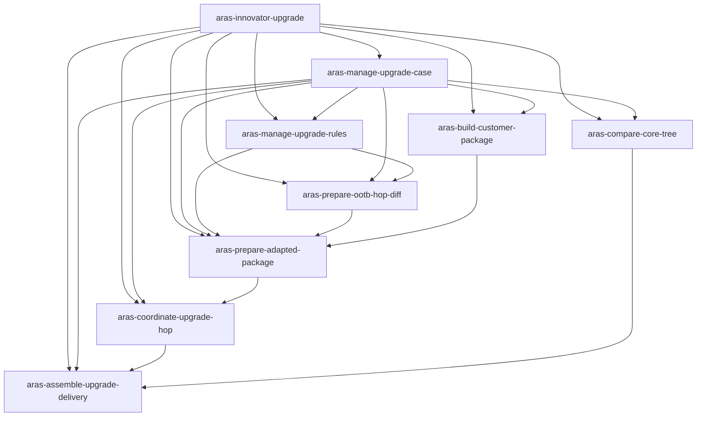

# Aras Innovator 升級協調 Skill Map

狀態：階段 0 已確認  
日期：2026-08-03

## 架構決策

採用三層架構：

1. 主 Skill `aras-innovator-upgrade` 負責辨識案件階段、讀取案件與執行歷程、功能路由、安全關卡、停止條件、證據及交接。
2. 功能 Skill 以可獨立驗收的業務能力拆分，不互相複製責任。
3. 細項執行能力優先放入功能 Skill 的固定程序、正式程式 command/action 或測試；只有具完整獨立輸入、輸出及安全邊界的能力才建立頂層 Skill。

Skill 不保存另一套核心業務邏輯。固定規則由 `ArasUpgradeOrchestrator.Core` 與其後續正式 command/action 實作；Skill 只負責讀取證據、選擇能力、提供參數及解釋結果。

4A 已建立共享 AML 低自由度執行單元：`AmlDocument`、`AmlNode`、`PackageCompareKey`、`PackageCompareKeyIndex`、`AmlSemanticComparer` 與 `PackageXmlPathMatcher`。它們不是獨立頂層 Skill；後續由 Rule 1、Rule 2 與規則管理功能 Skill 引用。

## 主 Skill

| Skill | 觸發條件 | 輸入 | 輸出 | 安全責任 | 相依關係 |
|---|---|---|---|---|---|
| `aras-innovator-upgrade` | 跨階段升級協調、目前狀態判定、下一步、異常、驗證或交接 | 案件根目錄、使用者意圖、案件清單、執行歷程、專案事實 | 階段與關卡摘要、所選功能 Skill、停止條件、證據缺口、下一個安全動作 | 不自行取代固定規則；未授權外部操作停止；未實作功能不得即席模擬；維持 Rollback 與 AI 資料邊界 | 依下表路由至一個或多個功能 Skill |

## 功能 Skill

| Skill | 狀態 | 觸發條件 | 主要輸入 | 主要輸出 | 安全責任 | 相依關係 |
|---|---|---|---|---|---|---|
| `aras-manage-upgrade-case` | 第一階段已建立 | 建立、開啟、檢查或更新案件；建立新版升級路徑；查看任務、關卡、歷程、中斷或重試資格 | 案件根目錄、案件欄位、版本化跳點、操作者、歷程 | 案件清單、任務圖、目前狀態、阻擋原因、可追溯的規劃或歷程動作 | 核對根層案件清單；既有路徑不可改寫；歷程只追加；重試須有證據；受控動作使用安全判定與目錄鎖 | 正式核心 `Cases`、`Tasks`、`Execution`、`Safety`；其他功能 Skill 共用案件識別及歷程 |
| `aras-build-customer-package` | 3.5 已建立核心與 Skill；UI／CLI 及獲授權 DB 執行器尚未建立 | 產生客戶 Package 基準、原始 Package 備份、一次性流程或 Export 排除處置 | 案件、來源 DB 備份證據、核准 Script、Export 證據 | 客戶 Package 基準、一次性鎖狀態、排除處置與證據 | DB 變更前一次性鎖；SQL 版本與 Checksum；匯入前單次確認；不自動 Rollback 或操作 Aras Export | `aras-manage-upgrade-case`；`CustomerPackageOneTimeFlow`、`CustomerPackageActionGate`、正式受控執行 command/action |
| `aras-prepare-ootb-hop-diff` | 4A AML 共享核心已建立；Rule 1 與本 Skill 後續建立 | 建立或驗證 Rule 1 OOTB 跳點差異包 | 來源／目標 OOTB `Solutions`、規則版本、工作目錄 | `SourceDiff`、`TargetDiff`、摘要、完成標記、封裝 Checksum | 原始輸入不可變；先建工作副本；AML 人工確認未解除不得完成 | `aras-manage-upgrade-case`、`aras-manage-upgrade-rules`；4A AML 核心與 AML Standard；Rule 1 command/action |
| `aras-prepare-adapted-package` | 4A AML 共享核心已建立；Rule 2 與本 Skill 後續建立 | 使用 Rule 2 準備特定跳點正式適配 Package | 客戶 Package 基準、`TargetDiff`、客戶 `Support\Solutions`、規則版本 | 來源工作副本、原始 Solutions 備份、候選／正式適配 Package、摘要 | 備份成功前不得寫入；只處理 XML；人工確認未解除不得交付；工作目錄鎖 | `aras-manage-upgrade-case`、`aras-manage-upgrade-rules`、`aras-prepare-ootb-hop-diff`；4A AML 核心與 AML Standard；Rule 2 command/action |
| `aras-manage-upgrade-rules` | 後續建立 | 建立、驗證、發布或檢查 Rule 1／Rule 2 規則集 | 規則草稿、共同準則、版本例外、操作者 | 驗證結果、不可變規則集版本、衝突或阻擋 | AI 不得發布；安全不變條件不可設定；執行中版本不可修改；衝突例外阻擋 | `aras-manage-upgrade-case`；AML Standard；規則管理 command/action |
| `aras-compare-core-tree` | 後續建立 | 比較及分類 Core Tree | 客戶來源、來源 OOTB、R38 OOTB、三份版本證據、內容比較規則版本 | A／B／C、待人工確認清單、摘要、`Incomplete`／`Completed` 標記 | 三份輸入驗證；不合併或修改 R38；多候選不猜測；每次嘗試新輸出；重疊目錄鎖 | `aras-manage-upgrade-case`；Core Tree command/action |
| `aras-coordinate-upgrade-hop` | 後續建立 | 執行、驗證或記錄單一 DB 升級跳點 | 正式適配 Package、前一跳點證據、Runbook、人工登入與備份證據 | 跳點嘗試、確認、Log 索引、驗證及 DB 備份關卡狀態 | 不啟動升級工具、不自動登入或備份；依序執行；下一跳等待驗證與備份 | `aras-manage-upgrade-case`、`aras-prepare-adapted-package`；跳點協調 command/action |
| `aras-assemble-upgrade-delivery` | 後續建立 | 檢查案件完成、組裝最終交付或交接 | R38 DB 備份識別、各跳點 Package、Core Tree 完成產出、完整歷程 | 交付清單、缺漏／阻擋摘要、差異與驗證摘要、交接資料 | 任一必要產物或證據缺漏即阻擋；不以資料夾存在推定完成；不覆寫歷程 | 其餘所有適用功能 Skill；交付驗證 command/action |

## 路由及相依關係

## 建立時程與整合驗收

- 階段 0：完成本 Skill Map。
- 階段 1：調整主 Skill，建立 `aras-manage-upgrade-case`，驗證案件、路徑、任務、歷程、安全判定及阻擋路徑。
- 4A AML：已建立共享正式核心；依 ADR 0002 保持為功能 Skill 內的低自由度執行單元，不建立微型頂層 Skill。
- Rule 1／Rule 2、Core Tree、跳點與交付：正式程式能力與對應功能 Skill 同步建立，不先建立沒有受測執行能力的空殼 Skill。
- 整合驗收：以主 Skill 路由情境及每個功能 Skill 的成功、錯誤、證據不足、未授權與中斷情境分別驗證。
