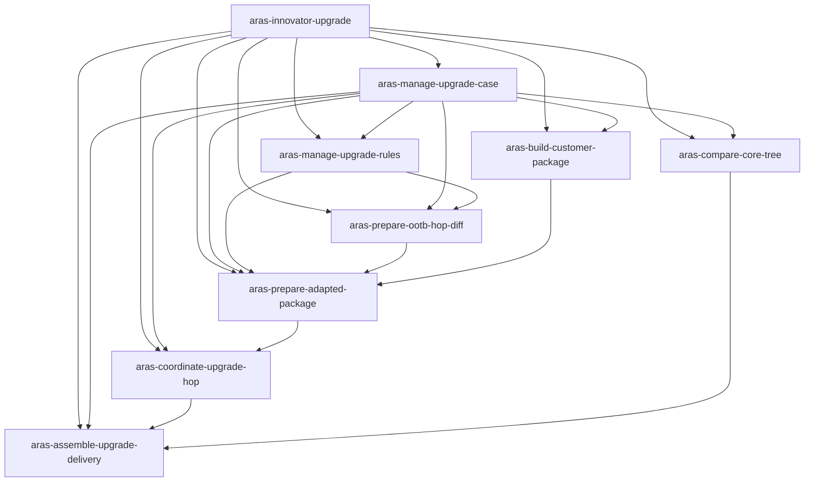

# Aras Innovator 升級協調 Skill Map

狀態：階段 0 已確認  
日期：2026-08-03

## 架構決策

採用三層架構：

1. 主 Skill `aras-innovator-upgrade` 負責辨識案件階段、讀取案件與執行歷程、功能路由、安全關卡、停止條件、證據及交接。
2. 功能 Skill 以可獨立驗收的業務能力拆分，不互相複製責任。
3. 細項執行能力優先放入功能 Skill 的固定程序、正式程式 command/action 或測試；只有具完整獨立輸入、輸出及安全邊界的能力才建立頂層 Skill。

Skill 不保存另一套核心業務邏輯。固定規則由 `ArasUpgradeOrchestrator.Core` 與其後續正式 command/action 實作；Skill 只負責讀取證據、選擇能力、提供參數及解釋結果。

4A 已建立共享 AML 低自由度執行單元：`AmlDocument`、`AmlNode`、`PackageCompareKey`、`PackageCompareKeyIndex`、`AmlSemanticComparer` 與 `PackageXmlPathMatcher`。它們不是獨立頂層 Skill；後續由 Rule 1、Rule 2 與規則管理功能 Skill 引用。

## 主 Skill

| Skill | 觸發條件 | 輸入 | 輸出 | 安全責任 | 相依關係 |
|---|---|---|---|---|---|
| `aras-innovator-upgrade` | 跨階段升級協調、目前狀態判定、下一步、異常、驗證或交接 | 案件根目錄、使用者意圖、案件清單、執行歷程、專案事實 | 階段與關卡摘要、所選功能 Skill、停止條件、證據缺口、下一個安全動作 | 不自行取代固定規則；未授權外部操作停止；未實作功能不得即席模擬；維持 Rollback 與 AI 資料邊界 | 依下表路由至一個或多個功能 Skill |

## 功能 Skill

| Skill | 狀態 | 觸發條件 | 主要輸入 | 主要輸出 | 安全責任 | 相依關係 |
|---|---|---|---|---|---|---|
| `aras-manage-upgrade-case` | 第一階段已建立 | 建立、開啟、檢查或更新案件；建立新版升級路徑；查看任務、關卡、歷程、中斷或重試資格 | 案件根目錄、案件欄位、版本化跳點、操作者、歷程 | 案件清單、任務圖、目前狀態、阻擋原因、可追溯的規劃或歷程動作 | 核對根層案件清單；既有路徑不可改寫；歷程只追加；重試須有證據；受控動作使用安全判定與目錄鎖 | 正式核心 `Cases`、`Tasks`、`Execution`、`Safety`；其他功能 Skill 共用案件識別及歷程 |
| `aras-build-customer-package` | 3.5 已建立核心與 Skill；UI／CLI 及獲授權 DB 執行器尚未建立 | 產生客戶 Package 基準、原始 Package 備份、一次性流程或 Export 排除處置 | 案件、來源 DB 備份證據、核准 Script、Export 證據 | 客戶 Package 基準、一次性鎖狀態、排除處置與證據 | DB 變更前一次性鎖；SQL 版本與 Checksum；匯入前單次確認；不自動 Rollback 或操作 Aras Export | `aras-manage-upgrade-case`；`CustomerPackageOneTimeFlow`、`CustomerPackageActionGate`、正式受控執行 command/action |
| `aras-prepare-ootb-hop-diff` | 4C 已建立核心與 Skill；UI／CLI 尚未建立 | 建立或驗證 Rule 1 OOTB 跳點差異包 | 來源／目標 OOTB `Solutions`、已發布 Rule 1 規則版本、新工作目錄 | `SourceDiff`、`TargetDiff`、摘要、完成標記、單一 ZIP 與封裝 Checksum | 原始輸入不可變；新嘗試不覆寫；錯誤與人工確認阻擋完成；兩端及版本證據均須驗證 | `aras-manage-upgrade-case`、`aras-manage-upgrade-rules`；`Rule1DiffEngine`、`OotbHopDiffBuilder`、`OotbHopDiffPackager`、4A AML 核心與 AML Standard |
| `aras-prepare-adapted-package` | 4D 已建立核心與 Skill；UI／CLI 及客戶正式目錄執行器尚未建立 | 使用 Rule 2 準備特定跳點正式適配 Package | 客戶 Package 基準、已驗證 `TargetDiff` ZIP、客戶 `Support\Solutions`、固定規則版本、新嘗試目錄 | 來源工作副本、原始 Solutions 備份、候選／正式適配 Package、摘要與不可覆寫完成紀錄 | 備份成功前不得寫入；只處理 XML；人工確認未解除不得交付；工作目錄鎖 | `aras-manage-upgrade-case`、`aras-manage-upgrade-rules`、`aras-prepare-ootb-hop-diff`；`Rule2AdaptationEngine`、`AdaptedPackageBuilder`、`AdaptedPackageFinalizer`、AML Standard |
| `aras-manage-upgrade-rules` | 4B 已建立核心與 Skill；UI／CLI 尚未建立 | 建立、驗證、發布或檢查 Rule 1／Rule 2 規則集 | 規則草稿、共同準則、版本例外、具名人工操作者與核准證據 | 驗證結果、不可變規則集版本與 Checksum、有效規則快照、衝突或阻擋 | AI 不得建立或發布；安全不變條件不可設定；已發布版本不可修改；衝突例外阻擋 | `aras-manage-upgrade-case`；AML Standard；`RuleSetValidator`、`RuleSetStore`、`RuleSetResolver` |
| `aras-compare-core-tree` | 階段 5 已建立核心與 Skill；UI／CLI 尚未建立 | 比較及分類 Core Tree | 客戶來源、來源 OOTB、R38 OOTB、三份版本證據、內容比較規則版本 | A／B／C、待人工確認清單、摘要、`Incomplete`／`Completed` 標記 | 三份輸入驗證；不合併或修改 R38；多候選不猜測；每次嘗試新輸出；重疊目錄鎖 | `aras-manage-upgrade-case`；`CoreTreeInputValidator`、`CoreTreeContentComparer`、`CoreTreeLogicalPathResolver`、`CoreTreeComparisonEngine`、`CoreTreeComparisonBuilder` |
| `aras-validate-core-tree-inputs` | 依 ADR 0003 建置中 | 驗證三份 Core Tree 及比較執行所需證據是否完整、安全且一致 | 客戶來源版 Core Tree、相同版本 OOTB Core Tree、目標版 OOTB Core Tree、三份版本證據、Server 文字比較規則版本及 Checksum、不存在的新輸出嘗試目錄 | 驗證通過的輸入清單及證據，或明確阻擋原因及穩定錯誤代碼 | 輸入、版本、規則或新輸出嘗試目錄不符即阻擋；不比較內容、不解析邏輯檔案、不分類、不複製檔案 | 父 `aras-compare-core-tree`；未來驗收 `aras-validate-core-tree-inputs/assets/acceptance-cases/`；現有 C# 參考實作 `CoreTreeInputValidator`，Skill 契約為規格來源 |
| `aras-compare-core-tree-content` | 依 ADR 0003 建置中 | 依 Core Tree Client／Server 規則判定兩個指定檔案在業務上是否相同 | 左、右兩個檔案、Core Tree 相對路徑、Client／Server 身分、Server 文字比較規則版本及 Checksum | `Equal` 或 `Different`、實際比較模式、規則版本、技術提示及證據 | Client 指定文字類型只忽略 CRLF／LF 與 UTF BOM；Server 只有明確指定路徑採文字比較，其他採串流二進位；無法可靠解碼時改採二進位並記錄原因；不掃描整棵樹、不解析目標檔案、不判定 A／B／C | 父 `aras-compare-core-tree`、`aras-classify-core-tree-differences`；未來驗收 `aras-compare-core-tree-content/assets/acceptance-cases/`；現有 C# 參考實作 `CoreTreeContentComparer`，Skill 契約為規格來源 |
| `aras-resolve-core-tree-file-mappings` | 依 ADR 0003 建置中 | 在目標版 OOTB Core Tree 解析來源檔案的唯一邏輯對應 | 來源相對路徑、目標版 OOTB Core Tree、允許的副檔名演進規則 | `None`、`Unique` 或 `Ambiguous`、套用的演進規則及所有候選相對路徑 | 只在相同相對目錄及相同主檔名內解析；不跨目錄搜尋、不預建版本對應表、多候選不得猜測；不比較內容、不判定分類、不複製或改名來源檔案 | 父 `aras-compare-core-tree`、`aras-classify-core-tree-differences`；未來驗收 `aras-resolve-core-tree-file-mappings/assets/acceptance-cases/`；現有 C# 參考實作 `CoreTreeLogicalPathResolver`，Skill 契約為規格來源 |
| `aras-classify-core-tree-differences` | 依 ADR 0003 建置中 | 掃描客戶 Core Tree，使用內容比較及邏輯對應產生 A／B／C、人工確認、錯誤及提示決策 | 三份已驗證 Core Tree、版本及規則證據、內容比較結果、邏輯檔案對應結果 | 穩定排序 A／B／C、待人工確認、錯誤及技術提示、規則版本、輸入證據及 `ReadyToComplete` 或 `Blocked` | 多候選或 A 類與目標碰撞轉人工確認，不建立分類 D；不建立 A／B／C 目錄、不修改三份輸入、不標記 `Completed` | 父 `aras-compare-core-tree`；`aras-compare-core-tree-content`、`aras-resolve-core-tree-file-mappings`；未來驗收 `aras-classify-core-tree-differences/assets/acceptance-cases/`；現有 C# 參考實作 `CoreTreeComparisonEngine`，Skill 契約為規格來源 |
| `aras-build-core-tree-delivery` | 依 ADR 0003 建置中 | 依已驗證分類結果在新的執行嘗試目錄建立可交接的比較產出 | 已完成分類結果、三份已驗證輸入及證據、不存在的新嘗試目錄 | A／B／C 交付目錄、分類摘要、人工確認、錯誤、Checksum、規則版本及 `Incomplete`／`Completed` 狀態 | 不重新分類、不修改任何輸入、不合併或修改 R38；錯誤或人工確認只產生 `Incomplete`，零錯誤且零人工確認才建立 `Completed`；重試建立新目錄且不覆寫舊結果 | 父 `aras-compare-core-tree`、`aras-classify-core-tree-differences`；未來驗收 `aras-build-core-tree-delivery/assets/acceptance-cases/`；現有 C# 參考實作 `CoreTreeComparisonBuilder`，Skill 契約為規格來源 |
| `aras-coordinate-upgrade-hop` | 後續建立 | 執行、驗證或記錄單一 DB 升級跳點 | 正式適配 Package、前一跳點證據、Runbook、人工登入與備份證據 | 跳點嘗試、確認、Log 索引、驗證及 DB 備份關卡狀態 | 不啟動升級工具、不自動登入或備份；依序執行；下一跳等待驗證與備份 | `aras-manage-upgrade-case`、`aras-prepare-adapted-package`；跳點協調 command/action |
| `aras-assemble-upgrade-delivery` | 後續建立 | 檢查案件完成、組裝最終交付或交接 | R38 DB 備份識別、各跳點 Package、Core Tree 完成產出、完整歷程 | 交付清單、缺漏／阻擋摘要、差異與驗證摘要、交接資料 | 任一必要產物或證據缺漏即阻擋；不以資料夾存在推定完成；不覆寫歷程 | 其餘所有適用功能 Skill；交付驗證 command/action |

## 路由及相依關係

## 建立時程與整合驗收

- 階段 0：完成本 Skill Map。
- 階段 1：調整主 Skill，建立 `aras-manage-upgrade-case`，驗證案件、路徑、任務、歷程、安全判定及阻擋路徑。
- 4A AML：已建立共享正式核心；依 ADR 0002 保持為功能 Skill 內的低自由度執行單元，不建立微型頂層 Skill。
- 4B 規則管理與版本化：已建立共用／版本例外草稿驗證、具名人工發布、不可變版本、Checksum、版本解析與衝突阻擋核心，以及對應功能 Skill；尚未執行 Rule 1／Rule 2。
- 4C Rule 1 OOTB 跳點差異包：已建立雙端 Item 分類、新嘗試輸出、錯誤隔離、人工確認阻擋、完成標記、單一 ZIP Checksum、重用驗證核心及對應功能 Skill；不修改原始 OOTB Package。
- 4D Rule 2 正式適配 Package：已建立 AML 遞迴與七步 Scalar 規則、federated Property、Rule 1 封裝驗證、Solutions 先備份、雙端 XML 工作副本、人工確認阻擋及不可覆寫完成紀錄核心與對應 Skill。
- 4E Package 整合測試：已串接一次性客戶 Package 基準、固定規則快照、Rule 1 ZIP 與 Rule 2 適配流程，驗證完整成功、跳點身分不一致、封裝竄改及人工確認阻擋行為。
- 階段 5 Core Tree：已建立三份輸入與版本證據、Client／Server 文字及二進位比較、相對路徑與副檔名演進、A／B／C、多候選人工確認、新嘗試產出、目錄鎖與完成標記核心及對應 Skill。
- 跳點與交付：正式程式能力與對應功能 Skill 同步建立，不先建立沒有受測執行能力的空殼 Skill。
- 整合驗收：以主 Skill 路由情境及每個功能 Skill 的成功、錯誤、證據不足、未授權與中斷情境分別驗證。
